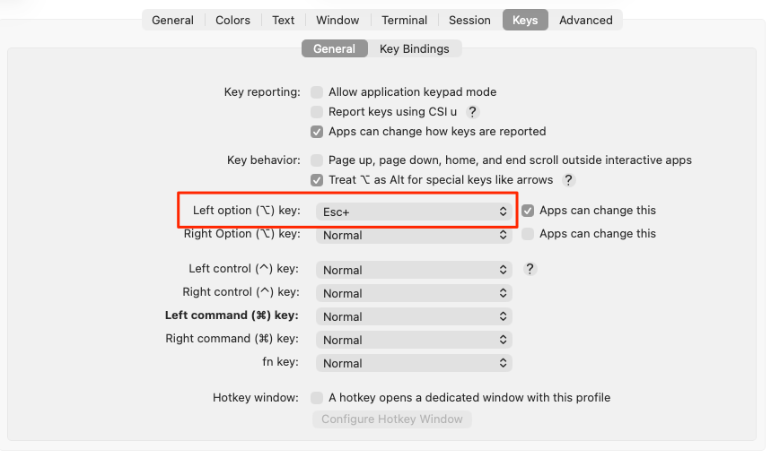

## はじめに

Claude Code をキーボード操作でスクロールできたので備呆録。

## 手順

### iTrem2 の設定

Profiles -> Keys -> General -> Left option (⌥) key: を `Esc+` に変更する。



### キーバインド設定を行う


- Scroll コンテキストで `alt+j`/`alt+k` を上下スクロールに割り当てる。


```json:~/.claude/keybindings.json
{
  "bindings": [
    {
      "context": "Scroll",
      "bindings": {
        "alt+j": "scroll:lineDown",
        "alt+k": "scroll:lineUp"
      }
    }
  ]
}
```

## 環境

- iTerm: Build 3.6.11

```console
❯ sw_vers
ProductName:        macOS
ProductVersion:     26.5.2
BuildVersion:       25F84

❯ claude -v
2.1.231 (Claude Code)
```

